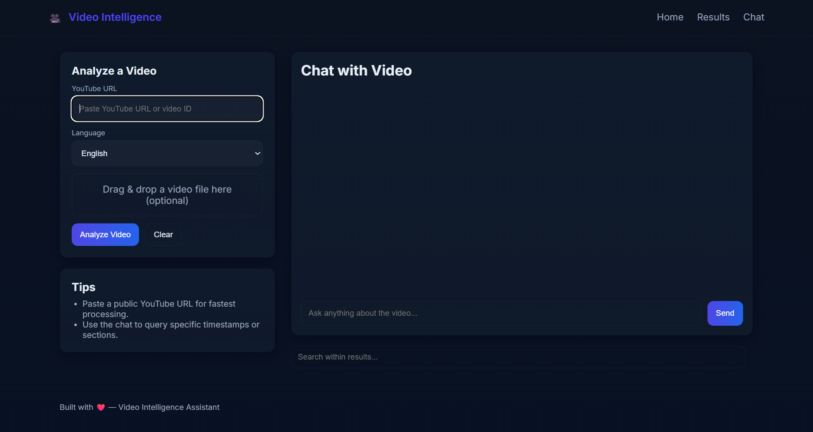
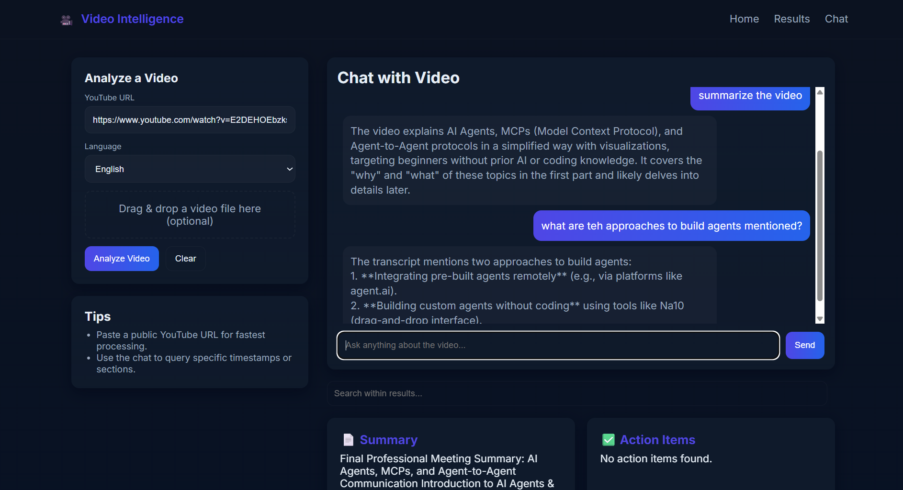

# 🎬 Video RAG

> Turn any YouTube video, local video, or audio recording into a searchable, conversational knowledge base — powered by Whisper, Mistral, and ChromaDB.

---

## Overview

**Video RAG** is an AI-powered pipeline that transcribes video/audio content and lets you interact with it through natural language Q&A. It extracts structured insights from the transcript — summaries, action items, key decisions, and open questions — then stores the content in a vector database for retrieval-augmented generation (RAG) based follow-up chat.

Whether you're processing meeting recordings, lectures, interviews, or YouTube videos, Video RAG turns passive content into an active knowledge base.

---

## ✨ Features

- 🎙️ **Transcription** — Converts video/audio to a timestamped transcript using OpenAI Whisper
- 📝 **Smart Summarization** — Generates a concise title and summary via Mistral LLM
- ✅ **Insight Extraction** — Pulls out action items, key decisions, and open questions automatically
- 🔍 **Vector Search** — Embeds transcript chunks into a local ChromaDB vector store
- 💬 **Conversational Q&A** — Chat with your transcript; answers are grounded in source content with timestamps
- 🌐 **Dual Interface** — Use via browser (FastAPI web UI) or terminal (CLI)
- 🌏 **Multilingual Support** — Supports English and Hinglish transcription

---

## 🛠️ Tech Stack

| Layer | Technology |
|---|---|
| Transcription | [OpenAI Whisper](https://github.com/openai/whisper) |
| LLM (Summarization & Chat) | [Mistral AI](https://mistral.ai/) |
| Vector Store | [ChromaDB](https://www.trychroma.com/) |
| Web Framework | [FastAPI](https://fastapi.tiangolo.com/) |
| Audio Processing | ffmpeg |
| Language | Python 3.10+ |

---

## 📁 Project Structure

```
video-rag/
├── main.py               # CLI pipeline entry point
├── app.py                # FastAPI app with /pipeline and /chat routes
├── core/
│   ├── transcription.py  # Whisper-based transcription logic
│   ├── extraction.py     # Action items, decisions, questions extraction
│   ├── summarization.py  # LLM-based summary and title generation
│   └── rag.py            # RAG query engine and vector search
├── utils/
│   └── audio.py          # Audio preprocessing helpers
├── templates/            # Jinja2 HTML templates for web UI
├── static/               # CSS / JS assets
├── vector_db/            # Local ChromaDB persistence
├── screenshots/          # UI screenshots
├── requirements.txt
└── .env.example
```

---

## ⚙️ Setup

### Prerequisites

- Python 3.10 or newer
- [`ffmpeg`](https://ffmpeg.org/download.html) installed and on your system PATH
- A [Mistral API key](https://console.mistral.ai/)
- *(Recommended)* A CUDA-capable GPU for faster Whisper inference

### Installation

```bash
# 1. Clone the repository
git clone https://github.com/your-username/video-rag.git
cd video-rag

# 2. Create and activate a virtual environment
python -m venv venv
source venv/bin/activate        # On Windows: venv\Scripts\activate

# 3. Install dependencies
pip install -r requirements.txt

# 4. Configure environment variables
cp .env.example .env
# Edit .env and add your MISTRAL_API_KEY
```

---

## 🔐 Environment Variables

Create a `.env` file in the project root:

```env
# Required
MISTRAL_API_KEY=your_mistral_api_key_here

# Optional
WHISPER_MODEL=small                       # Whisper model size: tiny, base, small, medium, large
```

**Whisper model sizes** (trade-off between speed and accuracy):

| Model | Parameters | Relative Speed | Best For |
|---|---|---|---|
| `tiny` | 39M | Fastest | Quick drafts |
| `base` | 74M | Fast | General use |
| `small` *(default)* | 244M | Moderate | Balanced |
| `medium` | 769M | Slow | Higher accuracy |
| `large` | 1550M | Slowest | Best accuracy |

---

## 🚀 Usage

### Option 1 — CLI

Process a single video and chat with it from your terminal:

```bash
python main.py
```

You will be prompted to provide:
- A YouTube URL **or** a local file path (video or audio)
- The transcription language: `english` or `hinglish`

The pipeline will transcribe, summarize, extract insights, and then drop you into an interactive Q&A session.

### Option 2 — Web App

Start the FastAPI server for the full browser experience:

```bash
uvicorn app:app --reload
```

Then open [http://localhost:8000](http://localhost:8000) in your browser.

---

## 📡 API Reference

| Method | Endpoint | Description |
|---|---|---|
| `GET` | `/` | Web UI home page |
| `GET` | `/health` | Health check |
| `POST` | `/pipeline` | Runs the full pipeline: transcription → summarization → extraction → RAG setup |
| `POST` | `/chat` | Ask a follow-up question against an existing session |

### `POST /pipeline` — Request Body

```json
{
  "source": "https://www.youtube.com/watch?v=...",
  "language": "english"
}
```

### `POST /chat` — Request Body

```json
{
  "session_id": "abc123",
  "question": "What were the key decisions made?"
}
```

---

## 🔄 How It Works

```
Input (YouTube URL / local file)
        │
        ▼
  Audio Extraction (ffmpeg)
        │
        ▼
  Transcription (Whisper)
        │
        ├──▶ Summarization & Title (Mistral)
        │
        ├──▶ Insight Extraction — Action Items / Decisions / Questions (Mistral)
        │
        └──▶ Chunking + Embedding → ChromaDB
                      │
                      ▼
              RAG-based Q&A (Mistral + ChromaDB retrieval)
```

---

## 📸 Screenshots

| Upload & Analyze  | Chat Interface |
|---|---|
|  |  |

---

## 🗺️ Roadmap

- [ ] Speaker diarization (identify who said what)
- [ ] Support for additional languages beyond English and Hinglish
- [ ] Export transcript + insights to PDF / Markdown
- [ ] Persistent chat history across sessions
- [ ] Docker support for easier deployment